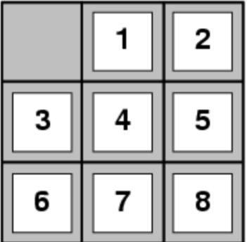
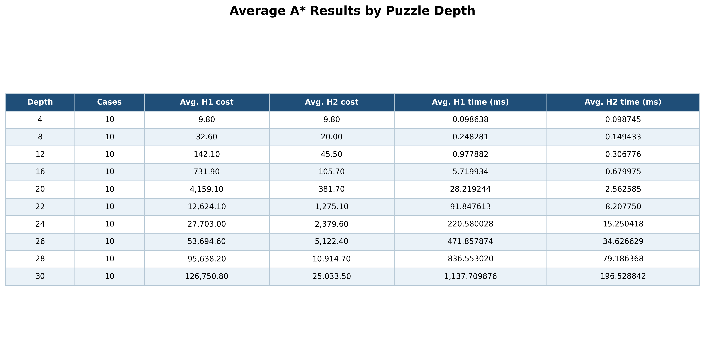
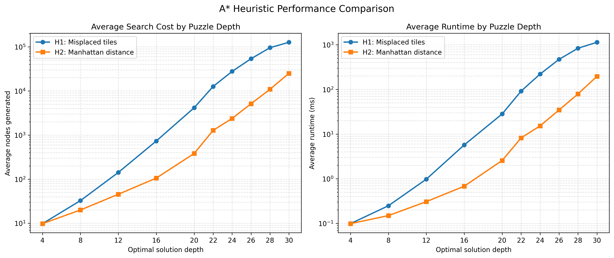

# CS4200 Project 1

## 8-Puzzle Problem
- Description: Sliding tile game played on a 3x3 grid with eight numbered squares and one empty space.
- Valid moves: Slide an adjacent tile (horizontally or vertically) into the empty space (represented with 0).
- Goal:



## How to run
1. Clone repository
```
git clone <link>
cd project1
```
2. Compile C++ code using Makefile
```
make
```
3. Run executable
```
./eight_puzzle
```

## Usage
- Choose between random puzzle or input manually.
- First random puzzle will give puzzle with depth < 6, second depth 9-15 and third depth > 18.
- Choose heurisitc approach (Manhattan Distance or Misplaced Tile Count).
- Program will output steps to reach goal state, search cost, and time in milliseconds.

## Heurisitic Approachs
- Number of Misplaced Tiles: count the number of tiles that are out of place.
- Manhattan Distance: sum of the distances of the tiles from their goal positions.

## Results


